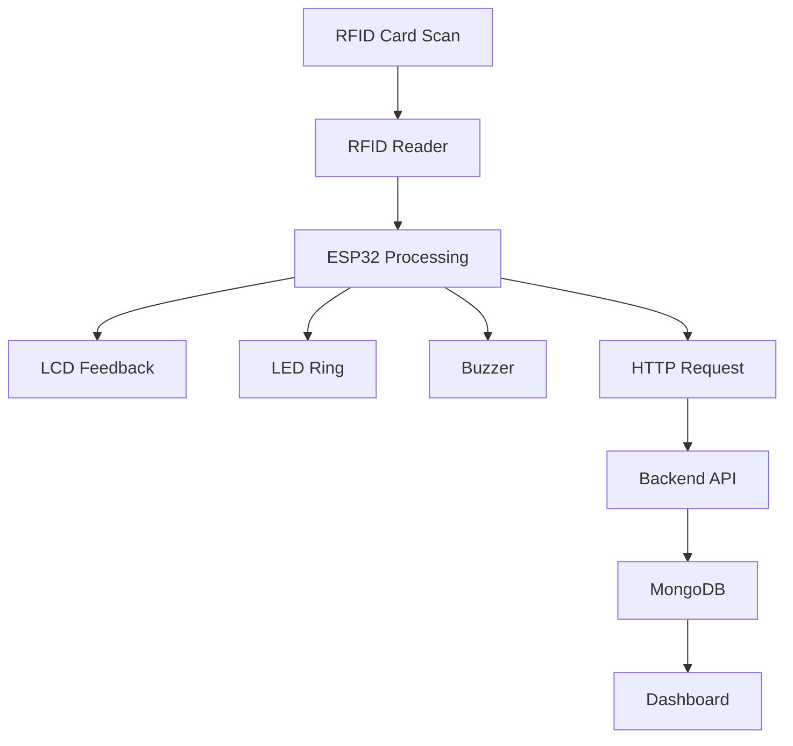

# StaffAvail – IoT Based Staff Availability Monitoring System

## Cover Page

**Project Title:** StaffAvail – IoT Based Staff Availability Monitoring System  
**Student Names:** Sanjay.V & J Hope Kumar 
**Institution:** Kristu Jayanti (Deemed To Be University)
**Academic Year:** 2026–2027  

---

# 1. Abstract

StaffAvail is an Internet of Things (IoT) based staff availability monitoring system designed to automate the process of tracking faculty and staff presence within an educational institution. Traditional attendance and availability monitoring methods often rely on manual record keeping, which can lead to inaccuracies, delays, and administrative overhead. The proposed system utilizes RFID technology, embedded computing, wireless communication, and cloud-connected backend services to provide a reliable and real-time solution.

The system is built around the ESP32 microcontroller, which interfaces with an MFRC522 RFID reader, an LCD display, a WS2812B NeoPixel ring, and an active buzzer. Staff members authenticate themselves using RFID cards when entering or leaving a designated area. Upon successful card detection, the ESP32 processes the user identification information, obtains accurate timestamps using Network Time Protocol (NTP) synchronization, and updates the user’s availability status. Visual and audio feedback mechanisms immediately notify users about successful scans.

Attendance events are transmitted through HTTP REST APIs to a Vert.x backend application. The backend validates and processes attendance records before storing them in a MongoDB database. A dashboard interface can then display real-time staff availability information and historical attendance records.

The proposed solution demonstrates how RFID-enabled IoT systems can improve operational efficiency, reduce manual intervention, and provide accurate occupancy information. The modular architecture enables scalability, supports future cloud integration, and offers opportunities for advanced analytics. Experimental testing confirms reliable RFID detection, successful wireless communication, accurate timestamping, and real-time database updates, making StaffAvail a practical and cost-effective solution for educational institutions and workplaces.

# 2. Introduction

## 2.1 Background

Educational institutions require efficient methods to monitor staff availability and attendance. Manual attendance systems are time-consuming and often fail to provide real-time information regarding faculty presence.

## 2.2 Need for Staff Availability Monitoring

A real-time availability system improves communication, resource planning, occupancy management, and administrative efficiency. Staff members, students, and administrators can quickly determine whether a faculty member is available.

## 2.3 Problem Statement

Traditional attendance systems lack real-time visibility, automated status updates, and integration with modern analytics platforms. There is a need for an automated solution capable of identifying staff presence instantly while maintaining accurate attendance records.

# 3. Objectives

- Develop an RFID-based staff authentication system.
- Provide real-time staff availability monitoring.
- Display status feedback using LCD and LED indicators.
- Generate audible confirmation using a buzzer.
- Store attendance events in MongoDB.
- Enable dashboard-based visualization.
- Ensure accurate timestamps using NTP synchronization.
- Create a scalable IoT architecture.

# 4. Literature Review

## 4.1 RFID Based Attendance Systems

RFID technology is widely used in attendance management systems due to its reliability, contactless operation, and fast identification capabilities. Studies indicate significant reductions in administrative workload and attendance errors.

## 4.2 IoT Monitoring Systems

IoT monitoring platforms combine sensors, controllers, and cloud services to provide real-time operational visibility. Such systems have been successfully implemented in industrial, educational, and healthcare environments.

## 4.3 Real-Time Occupancy Tracking

Real-time occupancy tracking solutions leverage wireless communication and database technologies to provide immediate information regarding user presence. These systems improve resource utilization and operational awareness.

# 5. System Requirements

## 5.1 Hardware Requirements

- ESP32 Development Board
- MFRC522 RFID Reader
- RFID Cards
- 16×2 LCD Display with I2C Module
- WS2812B NeoPixel Ring
- Active Buzzer
- USB Power Supply
- Connecting Wires

## 5.2 Software Requirements

- Arduino IDE
- ESP32 Board Package
- MFRC522 Library
- Adafruit NeoPixel Library
- LiquidCrystal I2C Library
- Wi-Fi Libraries
- Java Vert.x Framework
- Vert.x Web
- Vert.x Mongo Client
- MongoDB Database
- Postman (Testing)
- NTP Client Library

# 6. System Architecture

The StaffAvail architecture consists of three primary layers: Physical Layer, Edge Controller Layer, and Cloud & Analytics Layer.

The Physical Layer contains RFID cards and the MFRC522 reader. The Edge Controller Layer is implemented using the ESP32 microcontroller, which processes RFID events and controls output devices such as the LCD display, LED ring, and buzzer. The Cloud & Analytics Layer consists of a Java Vert.x reactive backend, MongoDB database, and dashboard analytics interface.

The Vert.x backend is responsible for receiving attendance events, processing RFID transactions asynchronously, maintaining staff availability state, and storing attendance records in MongoDB.


**Figure 3. StaffAvail System Architecture**

When a card is scanned, the ESP32 reads the UID, determines the attendance state, obtains a synchronized timestamp, and transmits the attendance event to the backend. The backend stores the event in MongoDB and updates the dashboard.

# 7. Hardware Design

## 7.1 ESP32 Controller

The ESP32 serves as the central processing unit. It provides Wi-Fi connectivity, GPIO interfaces, SPI communication for RFID operations, and I2C communication for the LCD display.

## 7.2 MFRC522 RFID Reader

The MFRC522 operates at 13.56 MHz and communicates with the ESP32 using SPI. It detects RFID cards and extracts unique identification information.

## 7.3 LCD Display

The 16×2 LCD with I2C interface displays operational messages including welcome prompts, user IDs, and attendance status updates.

## 7.4 NeoPixel Ring

The WS2812B LED ring provides visual feedback. Different colors can indicate successful scans, denied access, communication errors, or system status.

## 7.5 Active Buzzer

The active buzzer generates audible alerts to confirm successful attendance registration.

### Pin Connection Diagram


**Figure 1. ESP32 Peripheral Pin Connections**

# 8. Circuit Design and Pin Connections

## Complete Hardware Wiring


**Figure 2. Complete Hardware Wiring Diagram**

### Pin Mapping Table

| Component | Signal | ESP32 Pin |
|------------|---------|-----------|
| MFRC522 | SDA (SS) | GPIO 5 |
| MFRC522 | SCK | GPIO 18 |
| MFRC522 | MOSI | GPIO 23 |
| MFRC522 | MISO | GPIO 19 |
| MFRC522 | RST | GPIO 4 |
| MFRC522 | VCC | 3.3V |
| MFRC522 | GND | GND |
| LCD | SDA | GPIO 21 |
| LCD | SCL | GPIO 22 |
| LCD | VCC | 5V |
| LCD | GND | GND |
| NeoPixel Ring | DIN | GPIO 14 |
| NeoPixel Ring | VCC | 5V |
| NeoPixel Ring | GND | GND |
| Buzzer | Positive | GPIO 27 |
| Buzzer | Negative | GND |

# 9. System Workflow



# 10. Software Design

## 10.1 Firmware Logic

The ESP32 continuously monitors the RFID reader for card detection events. When a valid card is detected, the firmware extracts the UID, determines the user status, activates notification peripherals, and initiates backend communication.

## 10.2 Wi‑Fi Communication

The ESP32 connects to a configured Wi‑Fi network and maintains network availability throughout operation. Automatic reconnection mechanisms improve reliability.

## 10.3 HTTP Communication

Attendance records are transmitted through HTTP POST requests containing faculty ID, status, reader location, and timestamp information.

## 10.4 NTP Synchronization

The ESP32 obtains accurate timestamps from NTP servers, ensuring consistency across attendance records and backend systems.

# 11. Backend Design (Vert.x Reactive Architecture)

## 11.1 REST API

The backend exposes RESTful endpoints that receive attendance events from ESP32 devices.

### Sample Backend Payload

**Endpoint**

```http
POST /api/attendance
```

**Request Body**

```json
{
  "facultyId": "24CPEA15",
  "status": "IN",
  "readerId": "STAFFROOM_A",
  "timestamp": "2026-06-24T18:12:43"
}
```

## 11.2 Reactive Event Processing

The Vert.x backend processes attendance requests asynchronously using a non-blocking event-driven architecture. Incoming RFID scan events are handled through lightweight event loops, enabling efficient processing of multiple requests while maintaining low latency and high scalability.

## 11.3 Database Storage

Attendance records are stored in MongoDB collections, enabling efficient retrieval and dashboard visualization.

# 12. Database Design

### Sample MongoDB Document

```json
{
  "facultyId": "FAC001",
  "status": "IN",
  "readerId": "STAFFROOM_A",
  "timestamp": "2026-06-24 10:15:20"
}
```

The document model supports fast querying, scalability, and historical attendance analysis.

# 13. Results and Discussion

Testing demonstrated reliable RFID card detection and low-latency attendance processing. The LCD display successfully communicated attendance states and system prompts. The NeoPixel ring provided immediate visual confirmation, while the buzzer delivered audible acknowledgment.

The ESP32 consistently transmitted attendance events to the backend using HTTP communication. NTP synchronization ensured accurate timestamps across all records. MongoDB successfully stored attendance events, and dashboard integration enabled real-time staff availability visualization.

The wiring arrangement shown in Figure 2 enabled stable communication among all peripherals. The architecture presented in Figure 3 provided clear separation between hardware and cloud components. Backend processing logs confirmed successful attendance event handling.

### Backend Processing Log


**Figure 4. Backend Attendance Event Processing**

# 14. Advantages

- Real-time availability tracking.
- Contactless RFID authentication.
- Automated attendance recording.
- Reduced administrative workload.
- Accurate timestamp synchronization.
- Scalable architecture.
- Improved occupancy visibility.
- Cost-effective deployment.

# 15. Limitations

- Dependence on Wi‑Fi connectivity.
- RFID cards may be misplaced or damaged.
- Limited offline functionality.
- Requires power availability.
- Single-reader deployments cover only specific locations.

# 16. Future Enhancements

- Mobile application integration.
- Advanced analytics dashboard.
- Multiple reader support.
- Cloud deployment architecture.
- Geographical deployment management.
- AI-driven occupancy prediction.
- Role-based administrative controls.

# 17. Conclusion

StaffAvail successfully demonstrates the integration of RFID technology, embedded systems, wireless communication, and cloud-based backend services to provide a real-time staff availability monitoring solution. The system automates attendance recording, improves visibility of faculty presence, and reduces manual administrative effort. Experimental implementation verified successful RFID identification, peripheral feedback operation, reliable backend communication, and database storage. The modular design supports scalability and future enhancements, making the solution suitable for educational institutions, offices, and other occupancy-monitoring environments.

# 18. References

[1] K. Finkenzeller, *RFID Handbook*, 3rd ed., Wiley, 2010.

[2] M. Weiser, “The Computer for the 21st Century,” *Scientific American*, vol. 265, no. 3, pp. 94–104, 1991.

[3] Espressif Systems, *ESP32 Technical Reference Manual*, 2024.

[4] NXP Semiconductors, *MFRC522 RFID Reader Datasheet*, 2023.

[5] M. Collotta and G. Pau, “A Novel Energy Management Approach,” *IEEE Sensors Journal*, vol. 15, no. 1, pp. 186–194, 2015.

[6] C. Richardson, *Microservices Patterns*, Manning Publications, 2018.

[7] MongoDB Inc., *MongoDB Documentation*, 2025.

[8] Eclipse Foundation, "Vert.x Documentation", https://vertx.io/docs/, 2025.

[9] T. Segismont, "Building Reactive Applications with Eclipse Vert.x", O'Reilly Media, 2018.

[10] A. Banks and R. Gupta, “MQTT Version 3.1.1,” OASIS Standard, 2014.

[11] H. Ning and Z. Wang, “Future Internet of Things Architecture,” *IEEE Communications Magazine*, vol. 49, no. 11, pp. 136–142, 2011.
